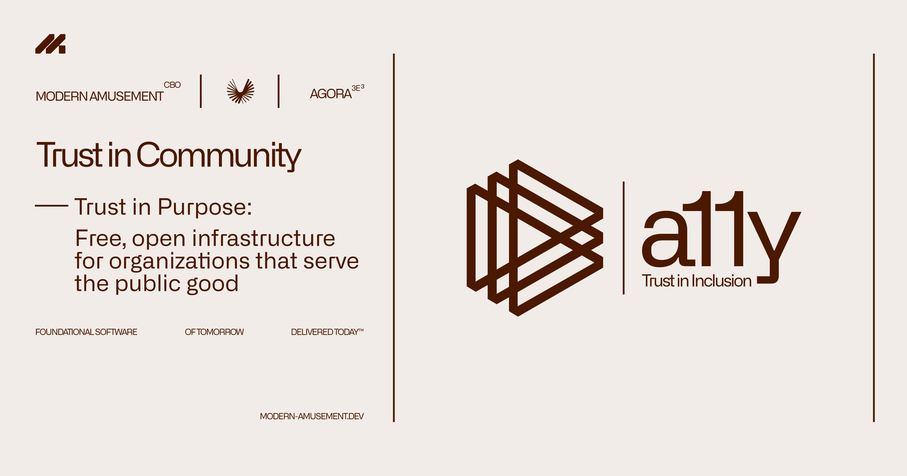
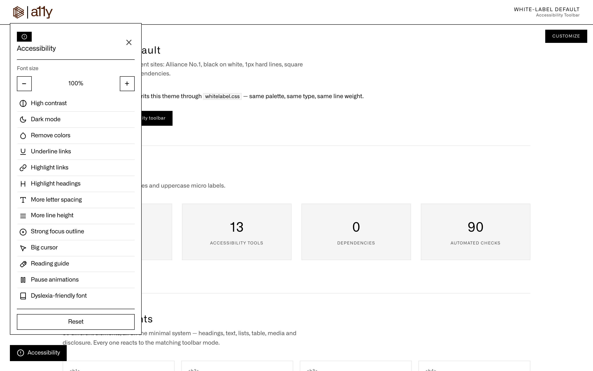
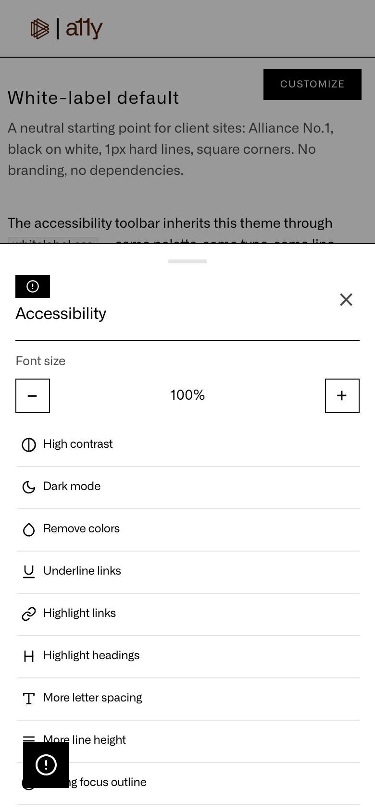

# Modern Amusement Accessibility Toolbar

**English** | [Deutsch](#deutsch)

**A dependency-free, white-label accessibility toolbar for any website.**
Free for non-profit organizations. Commercial use requires a commercial license (see [LICENSE](LICENSE)).

Demonstration & config playground: [demo/index.html](demo/index.html) — open locally with `npx serve .` and visit `/demo/`.



| Desktop panel | Mobile bottom sheet |
|---|---|
|  |  |

## Why

Many accessibility overlays cost non-profits money every month, phone home, or carry their own branding. This toolbar is:

- **100% self-hosted** — no external requests, no tracking, no telemetry, works offline.
- **White-label** — no branding by default, all labels and colors are yours.
- **Themeable** — colors, fonts, position, radius, labels, and which tools appear are all configurable.
- **Accessible itself** — keyboard operable, ARIA states, focus management, mobile bottom sheet, reduced-motion aware.
- **Works everywhere** — same-origin iframes and open Shadow DOM are covered, font scaling adapts to px- and rem-based sites, and a site's own root filter is preserved.

## Features

| Tool | Effect |
|---|---|
| High contrast | Black/white/blue palette with strong outlines (real color overrides, not a CSS filter) |
| Dark mode | Inverts the page (root-level filter, toolbar stays readable) |
| Remove colors | Full grayscale |
| Underline links | Forces underlines on all links |
| Highlight links | Yellow highlight on all links |
| Highlight headings | Yellow highlight on all headings |
| More letter spacing | +0.12em tracking |
| More line height | 1.9 line-height |
| Strong focus outline | High-visibility focus ring |
| Big cursor | 32px cursor everywhere |
| Reading guide | Yellow line that follows the pointer |
| Pause animations | Stops animations, transitions and smooth scrolling |
| Dyslexia-friendly font | Switches text to OpenDyslexic (bundled) or your own font |
| Font size | -/+ in configurable steps (80–150% by default) |
| Reset | Restores all defaults |

Preferences are stored in `localStorage` (key configurable) and applied before first paint on return visits.

The visual modes also reach same-origin iframes and open Shadow DOM. For the exact scope and the limits set by browser security, see [Integration & compatibility](#integration--compatibility).

## Quick start

```html
<link rel="stylesheet" href="a11y-toolbar.css">
<script>
  window.A11yToolbarConfig = {
    colors: { accent: '#0a7d55', surface: '#ffffff' },
    fonts:  { ui: "'Inter', system-ui, sans-serif" }
  };
</script>
<script src="a11y-toolbar.js" defer></script>
```

That's it — the toolbar auto-initializes and renders a floating trigger button (bottom-left by default). No build step, no dependencies.

To use the bundled OpenDyslexic font for the dyslexia toggle:

```html
<link rel="stylesheet" href="fonts/opendyslexic/opendyslexic.css">
```

To disable auto-init and control it yourself:

```js
window.A11yToolbarConfig = { autoInit: false };
// later:
A11yToolbar.init({ position: 'right' });
```

### Use an existing button as the trigger

```js
A11yToolbar.init({ trigger: '#my-a11y-button' });
```

## Configuration

Every key is optional. Full example: [`config.example.js`](config.example.js).

| Key | Type | Default | Description |
|---|---|---|---|
| `autoInit` | boolean | `true` | Auto-init on DOM ready when `window.A11yToolbarConfig` is set |
| `storageKey` | string | `'a11y_toolbar_prefs'` | localStorage key |
| `position` | `'left' \| 'right'` | `'left'` | Docking side of trigger and panel |
| `zIndex` | number | `2147483000` | Base z-index (trigger +1, backdrop -1); near the CSS maximum so the toolbar stays above page overlays |
| `trigger` | selector/element | `null` | Use an existing element instead of the generated button |
| `credit` | object/false | `false` | Optional attribution `{ text, name, url, logo }` |
| `toggles` | string[] | all 13 | Which tools to show, in order |
| `fontScale` | object | `{ step: 10, min: 80, max: 200, start: 100, mode: 'auto' }` | Font scaling; `mode` is `auto` \| `root` \| `zoom` (see below) |
| `scope` | object | `{ iframes: true, shadowDom: true }` | Propagate visual modes to same-origin iframes and open shadow roots |
| `colors` | object | — | See [Theming](#theming) |
| `fonts` | object | — | `ui` and `dyslexia` font-family strings |
| `offset` | object | `{ side: '1.5rem', triggerBottom: '1.5rem', panelBottom: '5.5rem' }` | Spacing |
| `labels` | object | English | All UI strings (see below) |
| `onOpen`, `onClose`, `onChange` | function | `null` | Callbacks |

Toggle ids: `contrast`, `invert`, `grayscale`, `underlineLinks`, `highlightLinks`, `highlightHeadings`, `letterSpacing`, `lineHeight`, `focusRing`, `bigCursor`, `readingGuide`, `pauseAnimations`, `dyslexiaFont`.

## Theming

Colors can be set in the JS config (`colors`) **or** as plain CSS custom properties — useful for CSS-only theming and CMS theme settings:

```css
:root {
  --a11y-accent: #6d28d9;            /* active buttons, borders, hover */
  --a11y-accent-text: #ffffff;
  --a11y-surface: #ffffff;           /* panel background */
  --a11y-surface-hover: #f4f1fb;     /* button background */
  --a11y-text: #1a1a1a;
  --a11y-text-muted: #5c5c5c;
  --a11y-border: #e2e2e2;
  --a11y-focus: #6d28d9;             /* focus-ring mode */
  --a11y-highlight: #ffff00;         /* highlight modes */
  --a11y-highlight-text: #000000;
  --a11y-reading-guide: #ffd54f;
  --a11y-reading-guide-bg: rgba(255, 213, 79, 0.35);
  --a11y-backdrop: rgba(0, 0, 0, 0.4);
  --a11y-radius: 12px;
  --a11y-radius-sm: 8px;
  --a11y-font-ui: 'Alliance No.1', system-ui, sans-serif;
  --a11y-font-dyslexia: 'OpenDyslexic', sans-serif;
  --a11y-z: 2147483000;
  --a11y-side: 1.5rem;
  --a11y-trigger-bottom: 1.5rem;
  --a11y-panel-bottom: 5.5rem;
  /* advanced: high-contrast palette */
  --a11y-contrast-bg: #ffffff;
  --a11y-contrast-text: #000000;
  --a11y-contrast-link: #0000ee;
  --a11y-contrast-link-hover: #551a8b;
}
```

`--a11y-base-filter` is set automatically when the page itself uses a CSS `filter` on `<html>` and invert/grayscale is active, so the site filter is preserved.

For a custom font, load it yourself (`@font-face` or a font service) and point `fonts.ui` / `fonts.dyslexia` (or the CSS variables) at it.

## Default theme

The shipped default theme follows the Modern Amusement design tokens (Bielefeld):

- **Colors — warm brown:** solid background `#F1ECE8`, text `#4B1800`, accent `#754D3A`, hover `#DCD1CB`, borders `#C7B7AE`.
- **Typography — Alliance No.1** (Modern Amusement brand font, self-hosted Regular + Bold): base `1rem` / line-height `1.5` / tracking `-0.02em`; titles and trigger `700`, badges and labels `600`, buttons `500`; the font-size value renders in a mono stack between two vertical rules (see `branding.svg`). No uppercase transforms, no positive letter-spacing, `-webkit-font-smoothing: antialiased`.
- **Layout — Bielefeld primitives, rendered minimal/brutalist:** a section header (badge pill + title) with a hard `2px` bottom line (`.content-section-header` pattern), font-size controls as square `2px`-outlined buttons, the 13 toggles as **line-separated rows** with a hard `4px` left accent when active, a full-width reset button, hard 2px panel outline and hard offset shadows (`8px 8px` panel, `3px 3px` controls). No glass, no rounded corners (badge pill `99px` is the only radius by default; both radius variables are configurable).
- **Spacing rhythm:** 4/8/12/16/20/24/32/48.

Everything above is overridable per integration via the `colors`/`fonts` options or the CSS variables.

A neutral **white-label theme** ships as `whitelabel.css` (black/white/gray, 1px lines, no offset shadows, Alliance No.1 only). Load it after `a11y-toolbar.css` — see `demo/whitelabel.html`, which also contains an 80-element content inventory and the live config playground.

## Labels / i18n

All strings are configurable. Defaults are English; the full set:

```js
labels: {
  open: 'Open accessibility',        // trigger aria-label
  triggerText: 'Accessibility',      // visible trigger text
  title: 'Accessibility',            // panel title
  close: 'Close',
  fontSize: 'Font size',
  fontDecrease: 'Decrease font size',
  fontIncrease: 'Increase font size',
  reset: 'Reset',
  resetAria: 'Reset all settings',
  credit: 'Developed by',
  toggles: {
    contrast: 'High contrast',
    invert: 'Dark mode',
    grayscale: 'Remove colors',
    underlineLinks: 'Underline links',
    highlightLinks: 'Highlight links',
    highlightHeadings: 'Highlight headings',
    letterSpacing: 'More letter spacing',
    lineHeight: 'More line height',
    focusRing: 'Strong focus outline',
    bigCursor: 'Big cursor',
    readingGuide: 'Reading guide',
    pauseAnimations: 'Pause animations',
    dyslexiaFont: 'Dyslexia-friendly font'
  }
}
```

A full German label set is in [`config.example.js`](config.example.js).

## JavaScript API

| Method | Description |
|---|---|
| `A11yToolbar.init(options)` | Initialize (destroys a previous instance first) |
| `A11yToolbar.destroy()` | Remove DOM, classes, listeners and theme variables |
| `A11yToolbar.open()` / `.close()` / `.togglePanel()` | Control the panel |
| `A11yToolbar.getPrefs()` | Current preferences (copy) |
| `A11yToolbar.setPrefs(partial)` | Update preferences programmatically |
| `A11yToolbar.reset()` | Reset all preferences |
| `A11yToolbar.toggle(id)` | Toggle a single feature |
| `A11yToolbar.version` | Library version |

## Browser support

Chrome/Edge, Firefox, Safari (current and previous major versions), iOS Safari, Android Chrome. Uses `localStorage`, CSS custom properties, `:is()`/`:not(selector list)`, constructed stylesheets (with a `<style>` fallback) and inline SVG. Shadow DOM support uses `:host-context()` (Firefox 120+); older Firefox simply leaves shadow roots untouched. Without JavaScript the toolbar doesn't render; content remains fully accessible.

## Integration & compatibility

- **Any website**: static HTML, WordPress (or any CMS), Shopify, site builders, SPAs. Include the two files directly, or inject them via Google Tag Manager.
- **Font scaling**: `fontScale.mode: 'auto'` applies a root font-size on rem/em-based sites and switches to CSS `zoom` on px-based sites — text scales either way. Default range up to 200% (WCAG 1.4.4).
- **Same-origin iframes**: visual modes propagate automatically (feature classes + constructed stylesheet) and are cleaned up on `destroy()`.
- **Open Shadow DOM**: styles are injected via `adoptedStyleSheets` (patched `attachShadow` + MutationObserver covers pre-existing and dynamically created roots).
- **Strict CSP**: the toolbar itself only needs `script-src` and `style-src` entries for its two files. Embedded styles use constructed stylesheets instead of inline `<style>` tags, so iframe and Shadow DOM support works even under a strict `style-src` policy.
- **Site root filters**: a `filter` the page itself sets on `<html>` is captured and composed with invert/grayscale instead of being overwritten.
- **Z-index**: default `2147483000` (configurable) keeps the toolbar above page overlays and modals.
- **Inline `!important` styles**: feature modes override ordinary inline styles and CSS-in-JS values. Inline declarations marked `!important` are a browser-level exception that no client-side tool can override.
- **Known hard limits**: closed shadow roots and cross-origin iframes cannot be styled — that is a browser security boundary, not a limitation of this toolbar.

## Accessibility notes

- The panel is a labelled `dialog`, the trigger exposes `aria-expanded`/`aria-controls`, toggles use `aria-pressed`.
- Escape closes, backdrop closes, focus is moved into the panel and returned to the trigger.
- `prefers-reduced-motion` removes the toolbar's own transitions.
- High contrast uses genuine color overrides so the fixed panel never breaks (a `filter` on a wrapper would).
- The tool does not replace a WCAG-conformant website — it complements it.

## Development & tests

```bash
npm install
npm test
```

- `tests/config.test.js` — Node smoke test: module import without a DOM, API surface, version sync with `package.json`, example config validity.
- `tests/browser.test.js` — full UI suite in real Chrome: all 13 tools, contrast/invert/grayscale behavior, theming, persistence, reset, Escape, focus, mobile bottom sheet, config playground.
- `tests/api.test.js` — JS API: manual init, external trigger, toggle subsets, `setPrefs`/`reset`, destroy cleanup, re-init, full theming.
- `tests/scope.test.js` — font-scale mode detection (root vs zoom), same-origin iframe and open Shadow DOM propagation, root filter composition.
- `tests/edge.test.js` — early init before the body exists, double init, empty toggle lists, missing trigger, corrupt/out-of-range/blocked storage, focus trap, RTL, contrast on form controls, degenerate fontScale config.

The suite auto-detects Chrome/Chromium; set `CHROME_PATH` to a browser binary if needed. CI runs the same suite on every push and pull request (`.github/workflows/tests.yml`).

## License

Dual license: **free for registered non-profit organizations**; any other use requires a commercial license. See [LICENSE](LICENSE).

Bundled OpenDyslexic font: SIL Open Font License 1.1 — [fonts/opendyslexic/OFL.txt](fonts/opendyslexic/OFL.txt).

---

## Deutsch

**Eine dependency-freie White-Label-Barrierefreiheits-Toolbar für jede Website.**
Kostenlos für gemeinnützige Organisationen. Jede andere Nutzung erfordert eine kommerzielle Lizenz (siehe [LICENSE](LICENSE)).

Demo & Konfigurations-Playground: [demo/index.html](demo/index.html) — lokal öffnen mit `npx serve .` und `/demo/` aufrufen.

### Warum

Viele Accessibility-Overlays kosten gemeinnützige Organisationen monatlich Geld, senden Daten nach außen oder tragen fremdes Branding. Diese Toolbar ist:

- **100 % selbst gehostet** — keine externen Requests, kein Tracking, keine Telemetrie, funktioniert offline.
- **White-Label** — standardmäßig kein Branding, alle Beschriftungen und Farben gehören dir.
- **Themebar** — Farben, Schriften, Position, Radius, Beschriftungen und die Auswahl der Werkzeuge sind konfigurierbar.
- **Selbst barrierefrei** — per Tastatur bedienbar, ARIA-Zustände, Fokus-Management, mobiles Bottom-Sheet, respektiert `prefers-reduced-motion`.
- **Funktioniert überall** — Same-Origin-iframes und offene Shadow Roots werden abgedeckt, die Schrift-Skalierung passt sich an px- und rem-basierte Seiten an, und ein eigener Root-Filter der Seite bleibt erhalten.

### Funktionen

| Werkzeug | Wirkung |
|---|---|
| Hoher Kontrast | Schwarz-Weiß-Blau-Palette mit kräftigen Konturen (echte Farb-Overrides, kein CSS-Filter) |
| Dunkles Design | Invertiert die Seite (Root-Filter, die Toolbar bleibt lesbar) |
| Farben entfernen | Vollständige Graustufen |
| Links unterstreichen | Erzwingt Unterstreichungen für alle Links |
| Links hervorheben | Gelbe Hervorhebung aller Links |
| Überschriften markieren | Gelbe Hervorhebung aller Überschriften |
| Mehr Buchstabenabstand | +0,12em Laufweite |
| Größerer Zeilenabstand | 1,9 Zeilenhöhe |
| Deutlicher Fokusrahmen | Gut sichtbarer Fokusring |
| Großer Mauszeiger | 32px-Cursor überall |
| Lesehilfe | Gelbe Linie, die dem Zeiger folgt |
| Animationen stoppen | Stoppt Animationen, Übergänge und weiches Scrollen |
| Dyslexie-freundliche Schrift | Wechselt den Text zu OpenDyslexic (mitgeliefert) oder zu einer eigenen Schrift |
| Schriftgröße | -/+ in konfigurierbaren Schritten (standardmäßig 80–150 %) |
| Zurücksetzen | Stellt alle Standardwerte wieder her |

Die Einstellungen werden in `localStorage` gespeichert (Schlüssel konfigurierbar) und bei Folgebesuchen vor dem ersten Rendern angewendet.

Die visuellen Modi erreichen auch Same-Origin-iframes und offene Shadow Roots. Genaue Reichweite und die Grenzen durch Browser-Sicherheit: siehe [Integration & Kompatibilität](#integration--kompatibilität).

### Schnellstart

```html
<link rel="stylesheet" href="a11y-toolbar.css">
<script>
  window.A11yToolbarConfig = {
    colors: { accent: '#0a7d55', surface: '#ffffff' },
    fonts:  { ui: "'Inter', system-ui, sans-serif" }
  };
</script>
<script src="a11y-toolbar.js" defer></script>
```

Das ist alles — die Toolbar initialisiert sich automatisch und rendert einen schwebenden Trigger-Button (standardmäßig unten links). Kein Build-Schritt, keine Abhängigkeiten.

Um die mitgelieferte OpenDyslexic-Schrift für den Dyslexie-Toggle zu verwenden:

```html
<link rel="stylesheet" href="fonts/opendyslexic/opendyslexic.css">
```

Um die Auto-Initialisierung abzuschalten und selbst zu steuern:

```js
window.A11yToolbarConfig = { autoInit: false };
// später:
A11yToolbar.init({ position: 'right' });
```

### Vorhandenen Button als Trigger verwenden

```js
A11yToolbar.init({ trigger: '#my-a11y-button' });
```

### Konfiguration

Jeder Schlüssel ist optional. Vollständiges Beispiel: [`config.example.js`](config.example.js).

| Schlüssel | Typ | Standard | Beschreibung |
|---|---|---|---|
| `autoInit` | boolean | `true` | Automatische Initialisierung, sobald `window.A11yToolbarConfig` gesetzt ist |
| `storageKey` | string | `'a11y_toolbar_prefs'` | localStorage-Schlüssel |
| `position` | `'left' \| 'right'` | `'left'` | Seite, an der Trigger und Panel andocken |
| `zIndex` | number | `2147483000` | Basis-z-Index (Trigger +1, Backdrop -1); nahe am CSS-Maximum, damit die Toolbar über Seiten-Overlays bleibt |
| `trigger` | Selektor/Element | `null` | Vorhandenes Element statt des generierten Buttons verwenden |
| `credit` | Objekt/false | `false` | Optionale Nennung `{ text, name, url, logo }` |
| `toggles` | string[] | alle 13 | Welche Werkzeuge in welcher Reihenfolge erscheinen |
| `fontScale` | Objekt | `{ step: 10, min: 80, max: 200, start: 100, mode: 'auto' }` | Schriftgrößen-Skalierung; `mode` ist `auto` \| `root` \| `zoom` (siehe unten) |
| `scope` | Objekt | `{ iframes: true, shadowDom: true }` | Visuelle Modi auf Same-Origin-iframes und offene Shadow Roots ausweiten |
| `colors` | Objekt | — | Siehe [Theming](#theming-1) |
| `fonts` | Objekt | — | Font-Family-Strings für `ui` und `dyslexia` |
| `offset` | Objekt | `{ side: '1.5rem', triggerBottom: '1.5rem', panelBottom: '5.5rem' }` | Abstände |
| `labels` | Objekt | Englisch | Alle UI-Texte (siehe unten) |
| `onOpen`, `onClose`, `onChange` | Funktion | `null` | Callbacks |

Toggle-IDs: `contrast`, `invert`, `grayscale`, `underlineLinks`, `highlightLinks`, `highlightHeadings`, `letterSpacing`, `lineHeight`, `focusRing`, `bigCursor`, `readingGuide`, `pauseAnimations`, `dyslexiaFont`.

### Theming

Farben lassen sich in der JS-Konfiguration (`colors`) **oder** als reine CSS-Custom-Properties setzen — praktisch für CSS-only-Theming und CMS-Theme-Einstellungen:

```css
:root {
  --a11y-accent: #6d28d9;            /* aktive Buttons, Rahmen, Hover */
  --a11y-accent-text: #ffffff;
  --a11y-surface: #ffffff;           /* Panel-Hintergrund */
  --a11y-surface-hover: #f4f1fb;     /* Button-Hintergrund */
  --a11y-text: #1a1a1a;
  --a11y-text-muted: #5c5c5c;
  --a11y-border: #e2e2e2;
  --a11y-focus: #6d28d9;             /* Fokusrahmen-Modus */
  --a11y-highlight: #ffff00;         /* Highlight-Modi */
  --a11y-highlight-text: #000000;
  --a11y-reading-guide: #ffd54f;
  --a11y-reading-guide-bg: rgba(255, 213, 79, 0.35);
  --a11y-backdrop: rgba(0, 0, 0, 0.4);
  --a11y-radius: 12px;
  --a11y-radius-sm: 8px;
  --a11y-font-ui: 'Alliance No.1', system-ui, sans-serif;
  --a11y-font-dyslexia: 'OpenDyslexic', sans-serif;
  --a11y-z: 2147483000;
  --a11y-side: 1.5rem;
  --a11y-trigger-bottom: 1.5rem;
  --a11y-panel-bottom: 5.5rem;
  /* fortgeschritten: Hoher-Kontrast-Palette */
  --a11y-contrast-bg: #ffffff;
  --a11y-contrast-text: #000000;
  --a11y-contrast-link: #0000ee;
  --a11y-contrast-link-hover: #551a8b;
}
```

`--a11y-base-filter` wird automatisch gesetzt, wenn die Seite selbst einen CSS-`filter` auf `<html>` nutzt und Invert/Graustufen aktiv ist — so bleibt der Seiten-Filter erhalten.

Für eine eigene Schrift diese selbst laden (`@font-face` oder Font-Dienst) und `fonts.ui` / `fonts.dyslexia` (oder die CSS-Variablen) darauf zeigen lassen.

### Standard-Theme

Das ausgelieferte Standard-Theme folgt den Modern-Amusement-Design-Tokens (Bielefeld):

- **Farben — warmes Braun:** solide Fläche `#F1ECE8`, Text `#4B1800`, Akzent `#754D3A`, Hover `#DCD1CB`, Rahmen `#C7B7AE`.
- **Typografie — Alliance No.1** (Modern-Amusement-Markenfont, selbst gehostet Regular + Bold): Basis `1rem` / Zeilenhöhe `1.5` / Laufweite `-0.02em`; Titel und Trigger `700`, Badges und Labels `600`, Buttons `500`; der Schriftgrößen-Wert rendert in einem Mono-Stack zwischen zwei vertikalen Linien (siehe `branding.svg`). Keine Uppercase-Transforms, keine positive Laufweite, `-webkit-font-smoothing: antialiased`.
- **Layout — Bielefeld-Primitives, minimal/brutalistisch umgesetzt:** Sektions-Header (Badge-Pill + Titel) mit harter `2px`-Unterlinie (`.content-section-header`-Muster), Schriftgrößen-Controls als eckige Buttons mit `2px`-Outline, die 13 Toggles als **zeilengetrennte Rows** mit hartem `4px`-Linksakzent im aktiven Zustand, full-width Reset-Button, harte `2px`-Panel-Kontur und harte Offset-Schatten (`8px 8px` Panel, `3px 3px` Controls). Kein Glass, keine Rundungen (nur die Badge-Pill `99px` als Standard-Radius; beide Radius-Variablen sind konfigurierbar).
- **Abstands-Rhythmus:** 4/8/12/16/20/24/32/48.

Alles oben ist pro Integration über `colors`/`fonts` oder die CSS-Variablen übersteuerbar.

Ein neutrales **White-Label-Theme** liegt als `whitelabel.css` bei (Schwarz/Weiß/Grau, 1px-Linien, keine Offset-Schatten, ausschließlich Alliance No.1). Nach `a11y-toolbar.css` laden — siehe `demo/whitelabel.html` mit 80-Elemente-Inventar und Live-Config-Playground.

### Beschriftungen / i18n

Alle Texte sind konfigurierbar. Standard ist Englisch; das vollständige Set:

```js
labels: {
  open: 'Open accessibility',        // aria-label des Triggers
  triggerText: 'Accessibility',      // sichtbarer Trigger-Text
  title: 'Accessibility',            // Panel-Titel
  close: 'Close',
  fontSize: 'Font size',
  fontDecrease: 'Decrease font size',
  fontIncrease: 'Increase font size',
  reset: 'Reset',
  resetAria: 'Reset all settings',
  credit: 'Developed by',
  toggles: {
    contrast: 'High contrast',
    invert: 'Dark mode',
    grayscale: 'Remove colors',
    underlineLinks: 'Underline links',
    highlightLinks: 'Highlight links',
    highlightHeadings: 'Highlight headings',
    letterSpacing: 'More letter spacing',
    lineHeight: 'More line height',
    focusRing: 'Strong focus outline',
    bigCursor: 'Big cursor',
    readingGuide: 'Reading guide',
    pauseAnimations: 'Pause animations',
    dyslexiaFont: 'Dyslexia-friendly font'
  }
}
```

Ein vollständiges deutsches Label-Set liegt in [`config.example.js`](config.example.js).

### JavaScript-API

| Methode | Beschreibung |
|---|---|
| `A11yToolbar.init(options)` | Initialisieren (zerstört zuvor eine bestehende Instanz) |
| `A11yToolbar.destroy()` | DOM, Klassen, Listener und Theme-Variablen entfernen |
| `A11yToolbar.open()` / `.close()` / `.togglePanel()` | Panel steuern |
| `A11yToolbar.getPrefs()` | Aktuelle Einstellungen (Kopie) |
| `A11yToolbar.setPrefs(partial)` | Einstellungen programmatisch ändern |
| `A11yToolbar.reset()` | Alle Einstellungen zurücksetzen |
| `A11yToolbar.toggle(id)` | Einzelnes Werkzeug umschalten |
| `A11yToolbar.version` | Bibliotheksversion |

### Browser-Unterstützung

Chrome/Edge, Firefox, Safari (aktuelle und vorherige Hauptversionen), iOS Safari, Android Chrome. Verwendet `localStorage`, CSS-Custom-Properties, `:is()`/`:not(Selektorliste)`, Constructed Stylesheets (mit `<style>`-Fallback) und Inline-SVG. Shadow-DOM-Unterstützung nutzt `:host-context()` (Firefox 120+); ältere Firefox-Versionen lassen Shadow Roots einfach unverändert. Ohne JavaScript wird die Toolbar nicht gerendert; die Inhalte bleiben vollständig zugänglich.

### Integration & Kompatibilität

- **Jede Website**: statisches HTML, WordPress (oder jedes CMS), Shopify, Baukasten-Systeme, SPAs. Die zwei Dateien direkt einbinden oder per Google Tag Manager injizieren.
- **Schrift-Skalierung**: `fontScale.mode: 'auto'` setzt eine Root-Schriftgröße auf rem/em-basierten Seiten und wechselt auf CSS `zoom` bei px-basierten Seiten — Text skaliert in beiden Fällen. Standardbereich bis 200 % (WCAG 1.4.4).
- **Same-Origin-iframes**: Visuelle Modi werden automatisch übertragen (Feature-Klassen + Constructed Stylesheet) und bei `destroy()` wieder entfernt.
- **Offenes Shadow DOM**: Styles werden per `adoptedStyleSheets` injiziert (gepatchtes `attachShadow` + MutationObserver deckt bestehende und dynamisch erzeugte Roots ab).
- **Strikte CSP**: Die Toolbar selbst braucht nur `script-src`- und `style-src`-Einträge für ihre zwei Dateien. Eingebettete Styles nutzen Constructed Stylesheets statt Inline-`<style>`-Tags, daher funktionieren iframe- und Shadow-DOM-Unterstützung auch unter strikter `style-src`-Policy.
- **Root-Filter der Seite**: Ein `filter`, den die Seite selbst auf `<html>` setzt, wird erfasst und mit Invert/Graustufen kombiniert statt überschrieben.
- **z-Index**: Standard `2147483000` (konfigurierbar) hält die Toolbar über Seiten-Overlays und Modals.
- **Inline-`!important`-Styles**: Die Feature-Modi überschreiben gewöhnliche Inline-Styles und CSS-in-JS-Werte. Inline-Deklarationen mit `!important` sind eine Browser-Ausnahme, die kein clientseitiges Werkzeug übersteuern kann.
- **Harte Grenzen**: Geschlossene Shadow Roots und Cross-Origin-iframes lassen sich nicht stylen — das ist eine Sicherheitsgrenze des Browsers, keine Einschränkung dieser Toolbar.

### Hinweise zur Barrierefreiheit

- Das Panel ist ein beschrifteter `dialog`, der Trigger nutzt `aria-expanded`/`aria-controls`, die Toggles `aria-pressed`.
- Escape schließt, der Backdrop schließt, der Fokus wandert ins Panel und zurück zum Trigger.
- `prefers-reduced-motion` entfernt die Übergänge der Toolbar selbst.
- Hoher Kontrast arbeitet mit echten Farb-Overrides, damit das fixierte Panel nie bricht (ein `filter` auf einem Wrapper würde das tun).
- Das Werkzeug ersetzt keine WCAG-konforme Website — es ergänzt sie.

### Entwicklung & Tests

```bash
npm install
npm test
```

- `tests/config.test.js` — Node-Smoke-Test: Modul-Import ohne DOM, API-Oberfläche, Versionsabgleich mit `package.json`, Gültigkeit der Beispiel-Konfiguration.
- `tests/browser.test.js` — vollständige UI-Suite in echtem Chrome: alle 13 Werkzeuge, Kontrast-/Invert-/Graustufen-Verhalten, Theming, Persistenz, Reset, Escape, Fokus, mobiles Bottom-Sheet, Konfigurations-Playground.
- `tests/api.test.js` — JS-API: manuelles Init, externer Trigger, Toggle-Teilmenge, `setPrefs`/`reset`, Destroy-Aufräumen, Re-Init, vollständiges Theming.
- `tests/scope.test.js` — Erkennung des Schrift-Skalierungsmodus (root vs. zoom), Übertragung auf Same-Origin-iframes und offenes Shadow DOM, Komposition des Root-Filters.
- `tests/edge.test.js` — frühes Init vor existierendem Body, Doppel-Init, leere Toggle-Listen, fehlender Trigger, korrupter/gesperrter Storage, Fokus-Trap, RTL, Kontrast auf Formular-Controls, degenerierte fontScale-Konfiguration.

Die Suite erkennt Chrome/Chromium automatisch; bei Bedarf `CHROME_PATH` auf ein Browser-Binary setzen. Die CI führt dieselbe Suite bei jedem Push und Pull Request aus (`.github/workflows/tests.yml`).

### Lizenz

Doppellizenz: **kostenlos für eingetragene gemeinnützige Organisationen**; jede andere Nutzung erfordert eine kommerzielle Lizenz. Siehe [LICENSE](LICENSE).

Mitgelieferte OpenDyslexic-Schrift: SIL Open Font License 1.1 — [fonts/opendyslexic/OFL.txt](fonts/opendyslexic/OFL.txt).

---

Made by [Modern Amusement](https://modern-amusement.dev/de).
